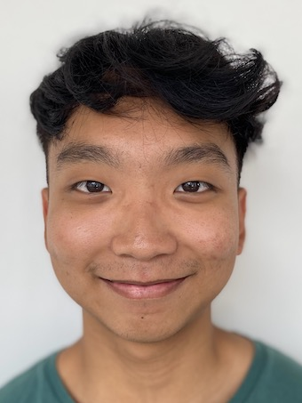
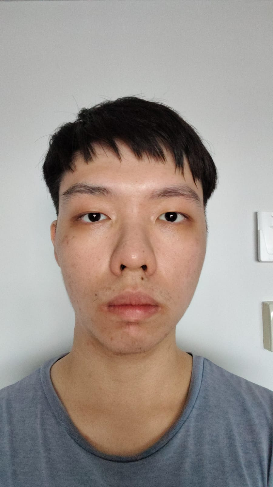

# About Us

We are a team based in the [School of Computing, National University of Singapore](http://www.comp.nus.edu.sg).

You can reach us at the email `seer[at]comp.nus.edu.sg`

## Project team

### Bek Ming Huan

[[homepage](http://www.comp.nus.edu.sg/~damithch)]
[[github](https://github.com/sciphi-123)]
[[portfolio](team/johndoe.md)]

* Role: Project Member

### Lae Zong Hon Justyn

[[github](https://github.com/curiousfun88)]
[[portfolio](team/johndoe.m)]

* Role: Project Member
* Responsibilities: UI

### Joshua Tan

[[github](http://github.com/J4Joshua)] [[portfolio](team/j4joshua.md)]

* Role: Developer
* Responsibilities: Data

### Nicholas Foo

[[github](https://github.com/FooNicholas)]
[[portfolio](team/foonicholas.md)]

* Role: Developer
* Responsibilities: Dev Ops + Threading

### Tan Yi Han

[[github](http://github.com/sean-g-han)]
[[portfolio](team/johndoe.md)]

* Role: Developer
* Responsibilities: UI
