# WealthVault User Guide

WealthVault is a **desktop app for managing contacts, optimized for use via a Line Interface** (CLI) while still having the benefits of a Graphical User Interface (GUI). If you can type fast, WealthVault can get your contact management tasks done faster than traditional GUI apps.

<!-- * Table of Contents -->
<page-nav-print />

---

## Quick start

1. Ensure you have Java `17` or above installed in your Computer. 
   **Mac users:** Ensure you have the precise JDK version prescribed [here](https://se-education.org/guides/tutorials/javaInstallationMac.html).

1. Download the latest `.jar` file from [here](https://github.com/AY2425S2-CS2103T-W12-2/tp/releases/tag/v1.3).

1. Copy the file to the folder you want to use as the _home folder_ for your application.

1. Open a command terminal, `cd` into the folder you put the jar file in, and use the `java -jar wealthvault.jar` command to run the application. 
   A GUI similar to the below should appear in a few seconds. Note how the app contains some sample data. 
   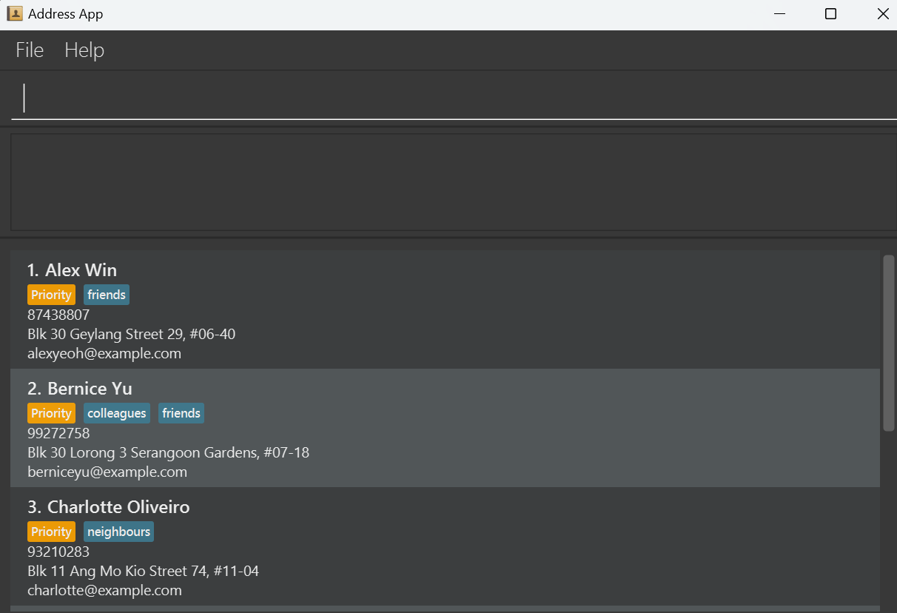

1. Type the command in the command box and press Enter to execute it. e.g. typing **`help`** and pressing Enter will open the help window. 
   Some example commands you can try:

   - `list` : Lists all contacts.

   * `addc n/John Doe p/98765432 e/johnd@example.com a/John street, block 123, #01-01` : Adds a contact named `John Doe` to the application.

   * `delc 3` : Deletes the 3rd contact shown in the current list.

   - `clear` : Deletes all contacts.

   - `exit` : Exits the app.

1. Refer to the [Features](#features) below for details of each command.

---

## Features

<box type="info" seamless>

**Notes about the command format:** 

- Words in `UPPER_CASE` are the parameters to be supplied by the user. 
  e.g. in `addc n/NAME`, `NAME` is a parameter which can be used as `addc n/John Doe`.

- Items in square brackets are optional. 
  e.g `n/NAME [t/POLICY_TAG]` can be used as `n/John Doe t/Policy A` or as `n/John Doe`.

- Items with `…`​ after them can be used multiple times including zero times. 
  e.g. `[t/POLICY_TAG]…​` can be used as ` ` (i.e. 0 times), `t/Policy B`, `t/Policy C t/Policy D` etc.

* Parameters can be in any order. 
  e.g. if the command specifies `n/NAME p/PHONE_NUMBER`, `p/PHONE_NUMBER n/NAME` is also acceptable.

* Extraneous parameters for commands that do not take in parameters (such as `help`, `list`, `exit` and `clear`) will be ignored. 
  e.g. if the command specifies `help 123`, it will be interpreted as `help`.

* **Use only the valid prefixes for each command format. Usage of prefixes other than the ones allowed can lead to the 
value of the last prefix being deemed invalid. For example, 
`addc n/Jo Ng e/j@gmail.com a/21 Lane p/81234321 x/Policy A` will result in the phone number being invalid as x/
is not a valid prefix for addc.**

- If you are using a PDF version of this document, be careful when copying and pasting commands that span multiple lines as space characters surrounding line-breaks may be omitted when copied over to the application.

**Notes about the fields:** 

- `-` (a single dash) can be used should it not be possible to supply a valid `PHONE_NUMBER`,
  `EMAIL` or `ADDRESS` at the point the details are entered. However, `-` cannot be used for `NAME`.
- Anything more than `-` (a single dash) could be interpreted differently (e.g. `--` is not valid for `PHONE_NUMBER`).

- `NAME` can only be up to 150 characters long, and cannot contain invalid symbols (e.g. \\).
- `NAME` has every first letter capitalised by default, to protect against identifying the same name with different
  casing as different names.

- `PHONE_NUMBER` should be of the format +[international code] [whitespace] [number] (e.g. +41 123; the `+` is optional).
  If no international code is provided, the phone number will start with +65.
- `PHONE_NUMBER`'s international code should not include whitespace.
- `PHONE_NUMBER`'s international code and number should be separated by a single whitespace.
- `PHONE_NUMBER`'s international code should be 1-3 digits long, and the number should be 3-13 digits long.

- `EMAIL` should be of the format [local-part]@[domain]. Standard domain names like gmail.com are definitely fine.
- `EMAIL` should not contain unnecessary whitespace.
- The local part of `EMAIL` should be alphanumeric, but it cannot start or end with any special characters.
  Nonetheless, it can contain +\_.-
- The domain name of `EMAIL` must end with a domain label at least 2 characters long. Every domain label
  must start and end with alphanumeric characters, must consist of alphanumeric characters, and can be
  separated only by hyphens (if any).

- `ADDRESS` should not be more than 150 characters long.

- `POLICY_TAG` should not be more than 150 characters long. It should not contain invalid symbols (e.g. \).

- `INDEX` should be obtained from the displayed client list. For example, if `findall` is used on a list of 10 clients
  such that there is only 1 client in the list eventually displayed, only `delc 1` is a valid command to delete a client.

</box>
### Viewing help : `help`

Shows a message explaning how to access the help page.

**Format**: `help`

### Adding a client: `addc`

Adds a client to WealthVault.

**Format**: `addc n/NAME p/PHONE_NUMBER e/EMAIL a/ADDRESS [t/POLICY_TAG]…​`

<box type="tip" seamless>

**Tips:**

- `n/NAME`, `p/PHONE_NUMBER`, `e/EMAIL` and `a/ADDRESS` are compulsory.
- `t/POLICY_TAG` is not compulsory. However, if t/ is used, a valid policy must be given.

</box>

**Examples**:

- `addc n/Jo Ng p/81234321 e/j@gmail.com a/21 Lane` adds a new client with the specified
  information
- `addc n/Daniel Lim p/91234567 e/d@mail.com a/8 View t/Policy A t/Policy B` adds a new client with the specified information
  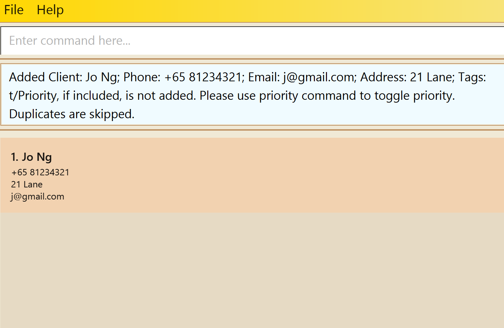
  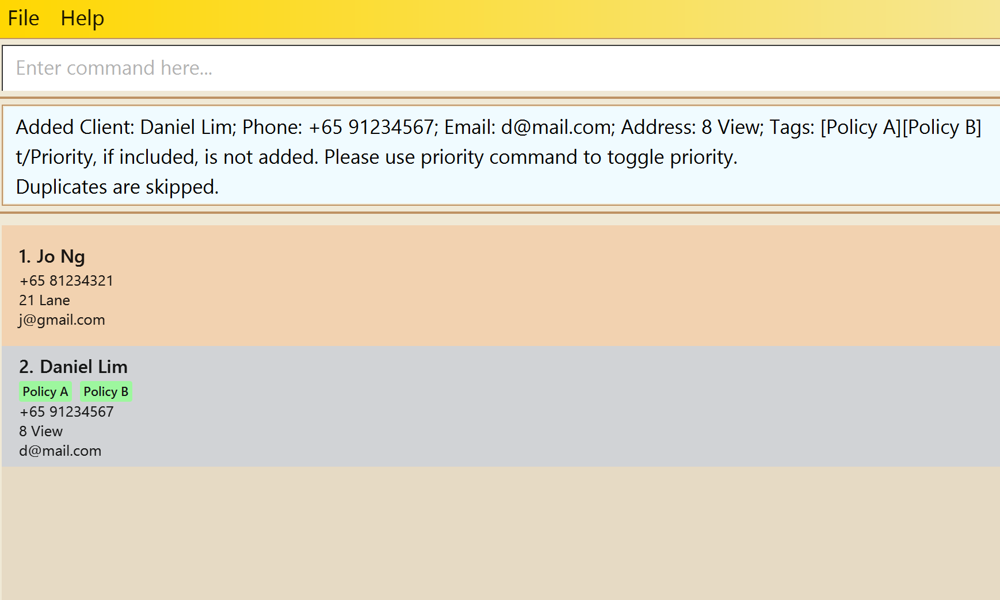

### Adding a policy: `addp`

Adds a policy to a client in WealthVault.

**Format**: `addp INDEX t/POLICY_TAG`

**Examples**:

- `addp 1 t/Health Insurance` adds `Health Insurance` policy tag to index `1` of the list (in this case, Jo Ng)
- `addp 2 t/Home Protection Plan` adds `Home Protection Plan` policy tag to index `2` of the list (in this case, Daniel Lim)
  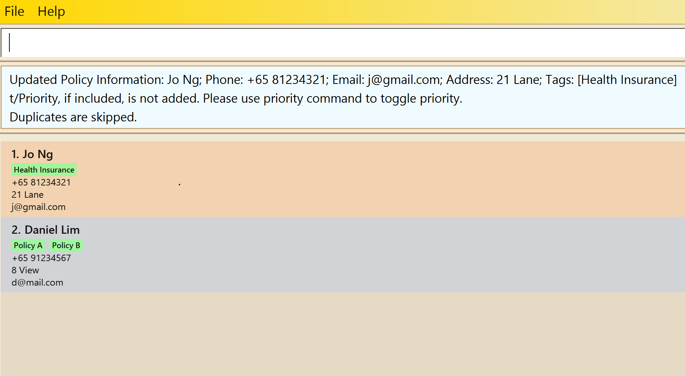
  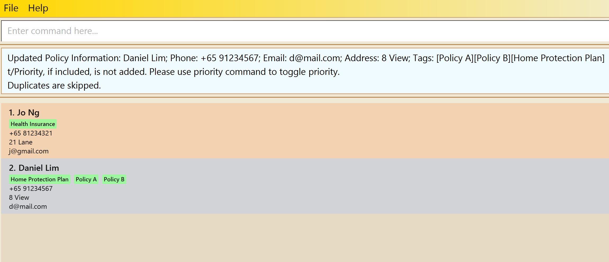

### Listing all clients : `list`

Shows a list of all clients in WealthVault.

**Format**: `list`

### Editing contact information : `edit`

Edits an existing person in the address book. This command allows changing the client's name and contact information (phone, email, address). Note that tags cannot be edited with this command.

**Format**: `edit INDEX [n/NAME] [p/PHONE] [e/EMAIL] [a/ADDRESS]​`

* Edits the person at the specified `INDEX`. The index refers to the index number shown in the displayed person list. The index **must be a positive integer** 1, 2, 3, …​
* At least one of the optional fields must be provided.
* Existing values will be updated to the input values.
* Tags cannot be edited using this command. Use the `addp` and `delp` commands instead

**Examples**:

*  `edit 1 p/91234567 e/johndoe@example.com` Edits the phone number and email address of the 1st person to be `91234567` and `johndoe@example.com` respectively.
*  `edit 2 n/Betsy Crower` Edits the name of the 2nd person to be `Betsy Crower`.

### Updating contact information : `update`

Updates only the contact information (phone, email, address) of an existing client in WealthVault. Unlike the `edit` command, this command cannot change the client's name or tags.

**Format**: `update INDEX [p/PHONE] [e/EMAIL] [a/ADDRESS]`

- Updates the client at the specified `INDEX`. The index refers to the index number shown in the displayed client list. The index **must be a positive integer** 1, 2, 3, …​
- At least one of the optional fields must be provided.
- Existing values will be updated to the input values.
- Name and tags cannot be modified using this command. Use the `edit` command instead.

**Examples**:

- `update 1 p/91234567 e/johndoe@example.com` Updates the phone number and email address of the 1st client to be `91234567` and `johndoe@example.com` respectively.
- `update 2 a/Clementi Ave 6` Updates only the address of the 2nd client to be `Clementi Ave 6`.

### Locating clients by name and tag: `findany`

Finds clients whose name or tag contain any of the given keywords.

**Format**: `findany KEYWORD [MORE_KEYWORDS]`

- The search is case-insensitive. e.g `hans` will match `Hans`
- The order of the keywords does not matter. e.g. `Hans Bo` will match `Bo Hans`
- Both the name and the tag is searched.
- Only full words will be matched e.g. `Han` will not match `Hans`
- Clients matching at least one keyword will be returned (i.e. `OR` search).
  e.g. `Hans Bo` will return `Hans Gruber`, `Bo Yang`

**Examples**:

- `findany John` returns `john` and `John Doe`
- `findany Jo priority` returns only clients whose name or tags matches either `priority` or `Jo` attached 
  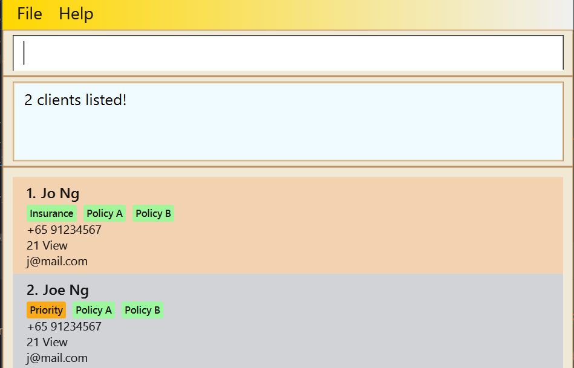

### Locating specific clients by name and tag: `findall`

Finds clients whose name or tag contain all of the given keywords.

**Format**: `findall KEYWORD [MORE_KEYWORDS]`

- The search is case-insensitive. e.g `hans` will match `Hans`
- The order of the keywords does not matter. e.g. `Hans Bo` will match `Bo Hans`
- Both the name and the tag is searched.
- Only full words will be matched e.g. `Han` will not match `Hans`
- Clients matching at least one keyword will be returned (i.e. `OR` search).
  e.g. `Hans Bo` will return `Hans Gruber`, `Bo Yang`

**Examples**:

- `findall John Doe` would return `John Doe` but not `Jane Doe` or `John Snow`
- `findall ng priority` returns only clients whose name or tags matches both `priority` and `ng` attached 
  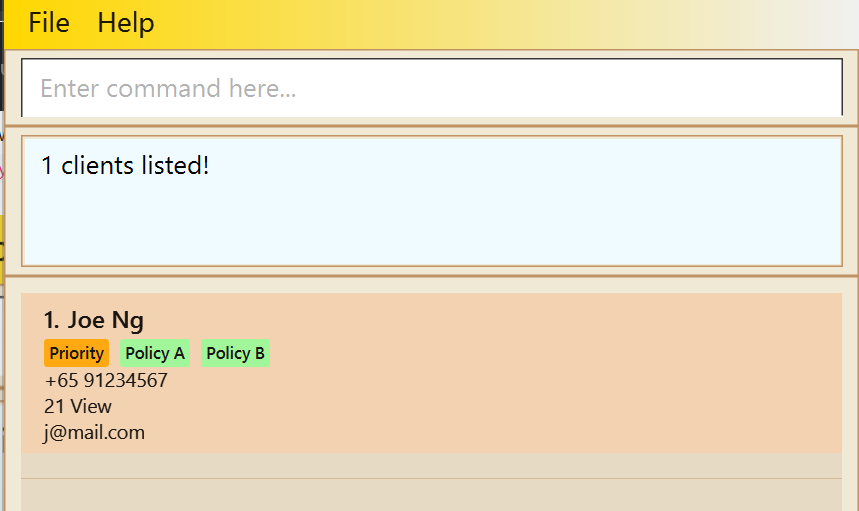

### Deleting a client : `delc`

Deletes the specified client from WealthVault.

**Format**: `delc INDEX`

- Deletes the client at the specified `INDEX`.
- The index refers to the index number shown in the displayed client list.
- The index **must be a positive integer** 1, 2, 3, …​

**Examples**:

- `list` followed by `delc 1` deletes the 1st client in the client list (in this case, John Tan).
- `findany Jane` followed by `delc 2` deletes the 2nd client in the results of the `findany` command (in this case, Jane Lee).
  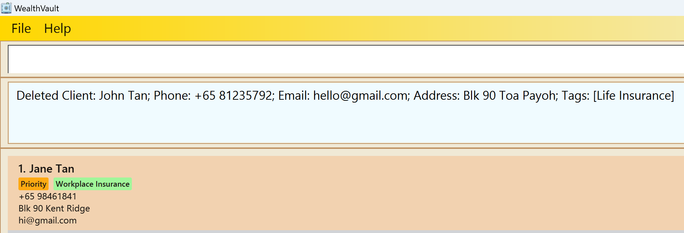
  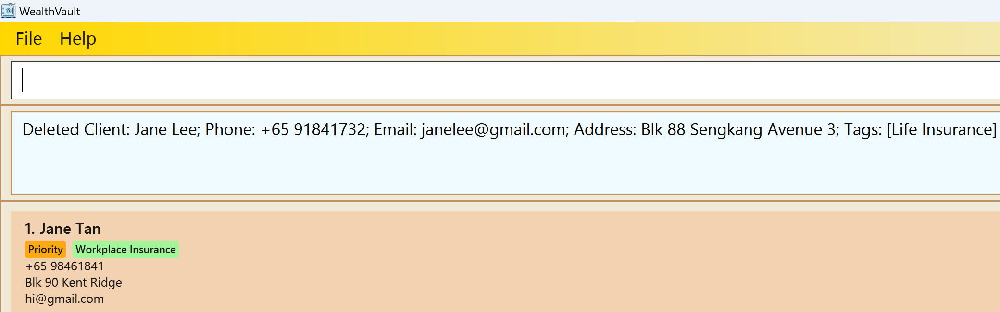

### Deleting multiple clients : `deleteclientmult`

Deletes multiple specified clients from WealthVault.

**Format**: `deleteclientmult i/INDEX [i/INDEX]…​`

- Deletes the clients at the specified `INDEX`es.
- The index refers to the index number shown in the displayed client list.
- The index **must be a positive integer** 1, 2, 3, …​
- Each index must be prefixed with `i/`.

**Examples**:

- `list` followed by `deleteclientmult i/1 i/2 i/3` deletes the first three clients in WealthVault.
- `findand Betsy` followed by `deleteclientmult i/1` deletes the 1st client in the results of the `findany` command.

### Deleting a policy: `delp`

Deletes the specified policy from WealthVault.

**Format**: `delp INDEX t/POLICY_TAG`

- Deletes the policy at the specified `INDEX`.
- The index refers to the index number shown in the displayed policy list.
- The index **must be a positive integer** 1, 2, 3, …​
- POLICY_TAG must match the policy name to be deleted.

**Examples**:

- `delp 1 t/Health Insurance` deletes `Health Insurance` policy tag from index `1` of the list (in this case, John Tan)
- `delp 2 t/Home Protection Plan` deletes `Home Protection Plan` policy tag from index `2` of the list (in this case, Jane Tan)

   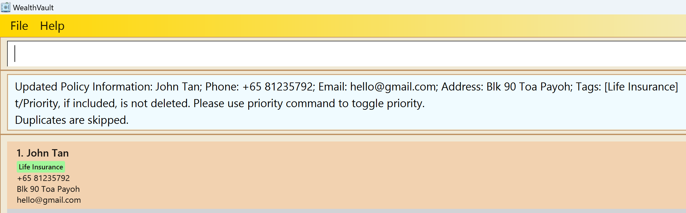
   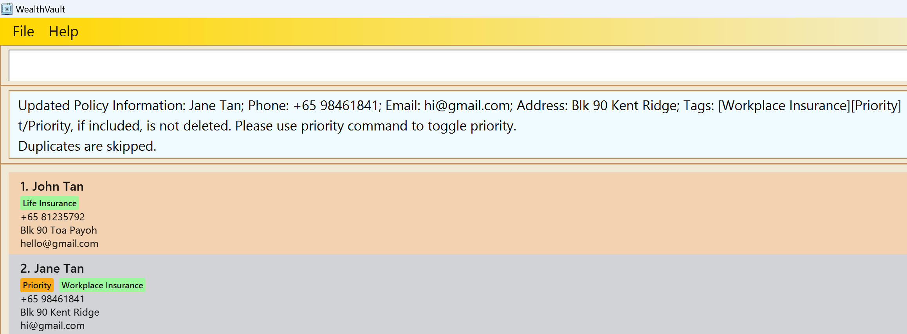

### Prioritising a client: `priority`

Toggles the priority of specified client from the application as indicated with a `Priority` tag.

**Format**: `priority INDEX [MORE INDEX]`

- Adds a "Priority" tag to the specified `INDEX` if such a tag isn't attached to the client
- Removes the "Priority" tag of the specified `INDEX` if such a tag is already attached to the client
- The index **must be a positive integer** 1, 2, 3, …​

**Examples**:

- `list` followed by `priority 1 3` adds a priority tag to the 1st client and 3rd client in the list if the client is yet to be attached with a "Priority" tag.
  Before |After
  -----------------|--------------------
  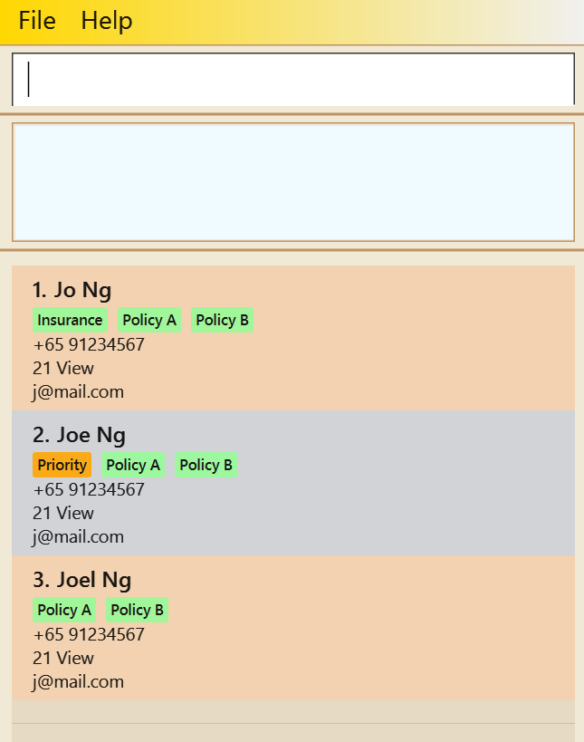 | 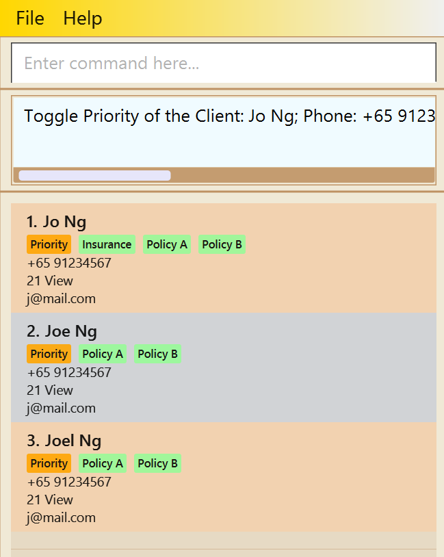

- `list` followed by `priority 3` removes a priority tag from the 3rd client in the list if the client is attached with a "Priority" tag.
  Before |After
  -----------------|--------------------
   | 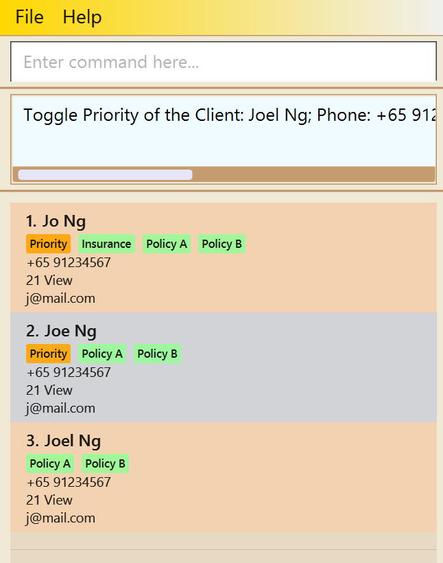

Potential Errors:

Errors           | Reason                                                                             |Fixes
-----------------|------------------------------------------------------------------------------------|------------------------
"Field is empty  | This error is thrown when no indexes are supplied to the `priority` command        | To fix this error, simply supply a proper index
"Index is not a non-zero unsigned integer" | This error is thrown when a non-zero unsigned integer is supplied like `a` or `-1` | To fix this error, simply supply a non-zero unsigned integer
"The client with the given index does not exist!"| This error is thrown when the specified index is bigger than the size of the list | To fix this error, input an index equal to or smaller than the size of the list

### Sorting by priority: `sortpriority`

Sorts all clients in the list by priority, with prioritized clients appearing at the top.

**Format**: `sortpriority`

* Clients with the "Priority" tag will be moved to the top of the list
* The relative order of clients within each group (prioritized and non-prioritized) is preserved
* This command affects only the display order and does not modify any client data

**Example**:
* `sortpriority` rearranges the list to show prioritized clients first, followed by non-prioritized clients.

### Clearing all entries : `clear`

Clears all entries from WealthVault.

**Format**: `clear`

### Exiting the program : `exit`

Exits the program.

**Format**: `exit`

### Saving the data

WealthVault data are saved in the hard disk automatically after any command that changes the data. There is no need to save manually.

### Editing the data file

WealthVault data are saved automatically as a JSON file `[JAR file location]/data/addressbook.json`. Advanced users are welcome to update data directly by editing that data file.

<box type="warning" seamless>

**Caution:**
If your changes to the data file makes its format invalid, WealthVault will discard all data and start with an empty data file at the next run. Hence, it is recommended to take a backup of the file before editing it. 
Furthermore, certain edits can cause the WealthVault to behave in unexpected ways (e.g., if a value entered is outside the acceptable range). Therefore, edit the data file only if you are confident that you can update it correctly.
</box>

### Archiving data files `[coming in v2.0]`

_Details coming soon ..._

---

## FAQ

**Q**: How do I transfer my data to another Computer? 
**A**: Install the app in the other computer and overwrite the empty data file it creates with the file that contains the data of your previous WealthVault home folder.

---

## Known issues

1. **When using multiple screens**, if you move the application to a secondary screen, and later switch to using only the primary screen, the GUI will open off-screen. The remedy is to delete the `preferences.json` file created by the application before running the application again.
2. **If you minimize the Help Window** and then run the `help` command (or use the `Help` menu, or the keyboard shortcut `F1`) again, the original Help Window will remain minimized, and no new Help Window will appear. The remedy is to manually restore the minimized Help Window.

---

## Command summary

| Action                      | Format, Examples                                                                                                                                                         |
| --------------------------- |--------------------------------------------------------------------------------------------------------------------------------------------------------------------------|
| **Add Client**              | `addc n/NAME p/PHONE_NUMBER e/EMAIL a/ADDRESS [t/POLICY_TAG]…​`   e.g., `addc n/James Ho p/22224444 e/jamesho@example.com a/123, Clementi Rd, 1234665 t/friend t/colleague` |
| **Add Policy**              | `addp INDEX t/POLICY_TAG `   e.g., `addp 1 t/Health Insurance`                                                                                                              |
| **Clear**                   | `clear`                                                                                                                                                                        |
| **Delete Client**           | `delc INDEX `  e.g., `delc 3`                                                                                                                                               |
| **Delete Multiple Clients** | `deleteclientmult i/INDEX [i/INDEX]…​`  e.g., `deleteclientmult i/3` or `deleteclientmult i/1 i/2 i/3`                                                                      |
| **Delete Policy**           | `delp INDEX t/POLICY_TAG`  e.g., `delp 2 t/Health Insurance`                                                                                                                |
| **Edit**                    | `edit INDEX [n/NAME] [p/PHONE_NUMBER] [e/EMAIL] [a/ADDRESS] [t/POLICY_TAG]…​`  e.g.,`edit 2 n/James Lee e/jameslee@example.com`                                             |
| **Update**                  | `update INDEX [p/PHONE_NUMBER] [e/EMAIL] [a/ADDRESS]`  e.g.,`update 2 p/91234567 e/jameslee@example.com`                                                                    |
| **Find (Or)**               | `findany KEYWORD [MORE_KEYWORDS]`  e.g., `findany James Jake`                                                                                                     |
| **Find (And)**              | `findall KEYWORD [MORE_KEYWORDS]`  e.g., `findall James Jake`                                                                                                   |
| **Priority**                | `priority INDEX [MORE_INDEX]`  e.g.,`priority 1 2 3`  
| **Sort Priority**           | `sortpriority` 
| **List**                    | `list`                                                                                                                                                                         |
| **Help**                    | `help`                                                                                                                                                                         |

